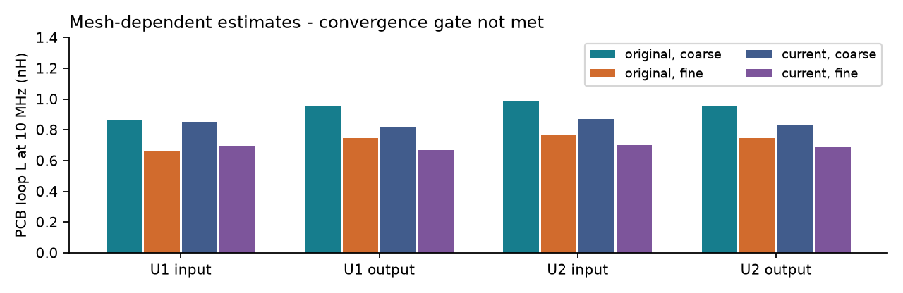
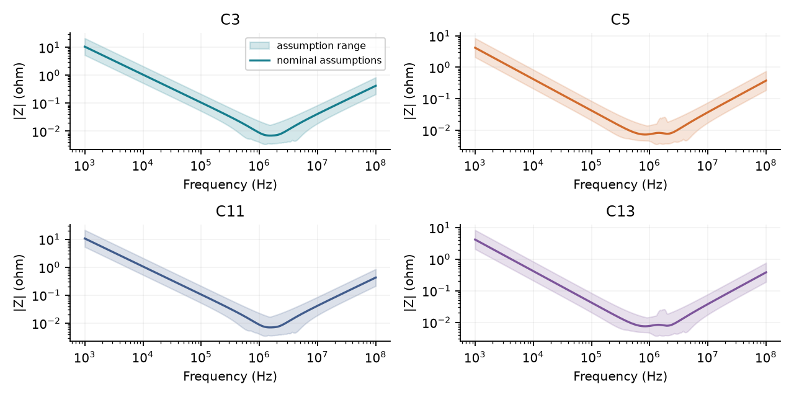
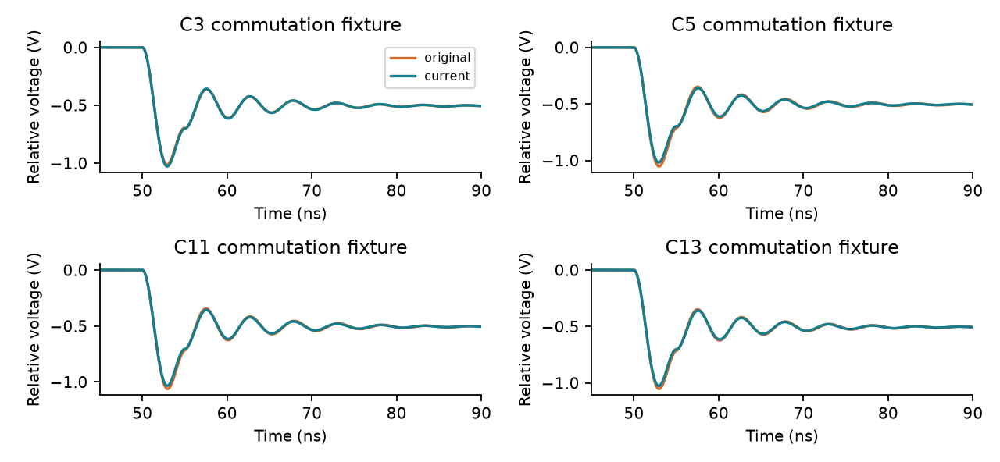
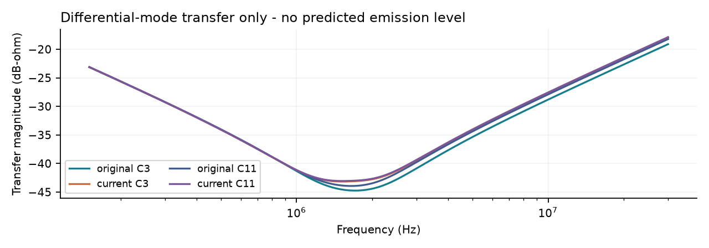
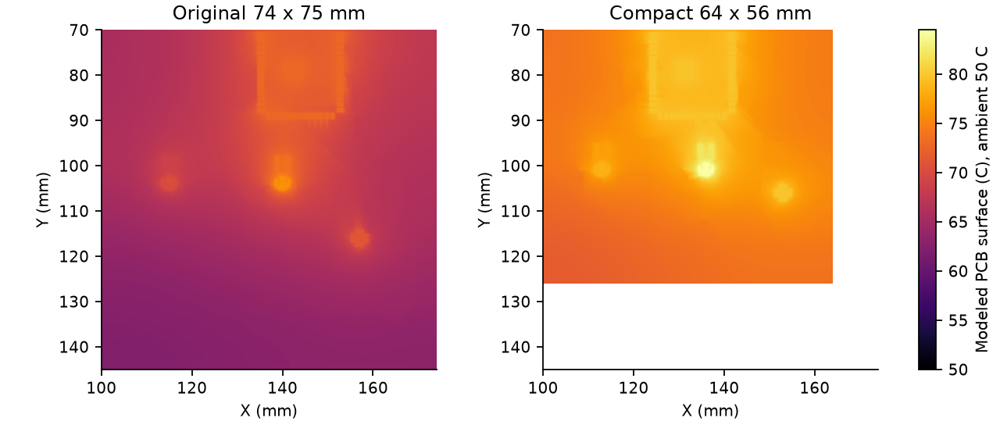

# Compact PCB test report
PR #122 / ESP32-S3 dual TPS63070 prototype / 4 September 2026

**Screening completed. Physical release is not approved.** The compact layout retains its geometric safeguards, but these simulations do not establish a measured EMI, switching-stress or junction-temperature margin. The copper extraction also fails the proposed mesh-convergence criterion.

| Assessment | Result | Meaning |
| --- | --- | --- |
| ERC / DRC / fabrication / connectivity | PASS | Zero rule violations; 342 pad nodes across 70 nets have saved copper. |
| Existing topology SPICE | PASS, 25 measures | Idealized regulator connectivity and operating assumptions only. |
| Monitoring / Python | PASS, 6 cases; 80 tests + 1 skip | Includes 12 independent numerical/provenance controls. |
| PCB-only loop extraction | PROVISIONAL | All four loops solved in both revisions; 21.6-31.8% inductance change on refinement exceeds the 5% target. |
| Passive / ringing / conducted-transfer fixtures | NUMERICAL CHECKS PASS | Assumed component and source models; not device-level physical qualification. |
| Comparative PCB thermal model | CONVERGENCE / ENERGY PASS | Compact peak is 8.4 C warmer in the reference scenario. |
| Hot, weak-cooling stress scenario | THERMAL CONCERN | Modeled compact PCB peak is 132.8 C at 50 C ambient. No junction margin established. |

**Layout decision:** retain the corrected short capacitor connections and the adjacent ground reference. Do not shrink this board further on the basis of these results. Small differences in extracted inductance are not reliable enough to rank the revisions. The compact board's thermal penalty is consistent in the converged comparison; approve the real load/cooling envelope before fabrication.

Tested PCB SHA-256: `0e17f9ad0cf0508d8a53ed51c0b1e6af4423311598bbb03fe811c556e8b1e7d8`. The copper is unchanged from commit `5ba7f87`; the comparison is the actual pre-compaction `f11e64e` board, not the flawed intermediate capacitor rotation. Full source, assumptions, raw data and failed-attempt evidence accompany this report.

<!-- pagebreak -->
# Parasitics and buck-boost placement

The local extraction includes F.Cu supply copper and ground, the saved In1 ground plane, both VIN or VOUT lands, PGND lands and plated return vias. The capacitor's solder-land ports close each PCB-only loop; package and capacitor body parasitics are excluded and added separately in the circuit fixtures. It uses 35 um outer copper, 17.5 um inner copper, 0.2 mm F.Cu/In1 center spacing and 25 um via plating, all provisional.

| Loop capacitor | Fine DC R, old/new (mohm) | Original L, coarse/fine (nH) | Compact L, coarse/fine (nH) |
| --- | --- | --- | --- |
| C3 | 2.77 / 3.21 | 0.866 / 0.657 | 0.852 / 0.690 |
| C5 | 3.50 / 3.05 | 0.952 / 0.748 | 0.813 / 0.667 |
| C11 | 3.57 / 3.30 | 0.989 / 0.769 | 0.869 / 0.702 |
| C13 | 3.50 / 3.26 | 0.951 / 0.747 | 0.832 / 0.685 |

Resistance is from the 1 Hz result; inductance is at 10 MHz. Coarse/fine grid pitch is 0.25/0.125 mm. Current-board checks also expand the local window by 2 mm per side and use three thickness filaments at 0.2 mm pitch. The latter changes two discretization settings and is not an isolated skin-effect convergence proof. All frequency sweeps cover 1 Hz-100 MHz.

**The mesh gate fails.** Grid strips and equipotential contact patches approximate small irregular copper features. Refinement changes the answer materially, even though FastHenry's straight-conductor resistance calibration passes. These values are candidate ranges, not validated board inductances or evidence that the new layout is quieter. Improve/conform the local mesh and verify final stackup before accepting absolute values or small revision deltas. One fine-mesh run required the documented segment-preconditioner retry; both the failed and completed transcripts are retained.

The physical layout still has direct 0.4 mm connections and 1.81 mm power-pad center separations at C3/C5/C11/C13, plus local ground vias. These are sound geometric safeguards; pad distance alone is not complete-loop inductance. [TI layout guidance](https://www.ti.com/lit/ds/symlink/tps63070.pdf), [FastHenry manual](https://www.fastfieldsolvers.com/Download/FastHenry_User_Guide.pdf).

<!-- pagebreak -->
# Passive supply impedance

Each revision has 324 combinations: four local banks times 25/50/100% nominal capacitance, 3/10/30 mohm ESR, 0.3/0.6/1.2 nH capacitor ESL and 0.5/1/2 times the candidate copper inductance. The nominal case uses 50%, 10 mohm, 0.6 nH and 1x. These are assumptions; several capacitor MPNs and bias curves remain unspecified.

| Compact bank | Nominal effective C (uF) | Z at 2.4 MHz (mohm) | Assumption range (mohm) |
| --- | --- | --- | --- |
| C3 | 15.0 | 8.26 | 3.87-22.82 |
| C5 | 38.0 | 8.19 | 4.00-20.66 |
| C11 | 15.0 | 8.37 | 3.93-23.05 |
| C13 | 38.0 | 8.36 | 4.13-21.00 |

The nearest capacitor loop uses the fine FastHenry candidate. Other branches use distance-scaled proxies; their shared return and mutual inductance are not extracted. Only local banks are included. ESP32/amplifier decoupling and regulator closed-loop output impedance are outside this model. Consequently these results cannot certify a Wi-Fi load step, control stability or total rail ripple.

The ngspice nominal sweeps agree with independent complex-impedance equations within 0.1% (the actual errors are much smaller in the JSON). At the lowest modeled capacitance fraction, each local output bank totals 19 uF, but actual effective capacitance must be checked against the selected parts and the datasheet's inductance-dependent requirements. No low-frequency droop target is declared passed: that requires the real source/regulator/load dynamics. [ngspice documentation](https://ngspice.sourceforge.io/docs.html), [TPS63070 component requirements](https://www.ti.com/lit/ds/symlink/tps63070.pdf).

<!-- pagebreak -->
# Ringing: bounded commutation tests

C3/C11 represent the input-side (L1) commutation path; C5/C13 represent the output-side (L2) path. The fixture applies a 1 A current ramp to a passive RLC path. The nominal edge is 5 ns, assumed node capacitance 300 pF, package inductance 1.5 nH and damping 0.5 ohm. Voltage is relative to the fixture's clamped rail and includes resistive drop; it is not a predicted TPS63070 switch voltage.

| Compact loop | Nominal peak excursion (V/A) | Sensitivity range (V/A) | Half-step peak change |
| --- | --- | --- | --- |
| C3 | 1.028 | 0.15-5.37 | 0.096% |
| C5 | 1.018 | 0.15-5.33 | 0.102% |
| C11 | 1.033 | 0.15-5.39 | 0.092% |
| C13 | 1.026 | 0.15-5.36 | 0.097% |

Each loop has 243 independent linear sensitivity cases spanning 2/5/20 ns edges, 100/300/1000 pF, 0.5/1.5/3 nH package inductance, 0.1/0.5/2 ohm damping and 0.5/1/2 times candidate PCB inductance. Linear scaling covers 0.5/1/2 A. Each revision has four nominal ngspice transients plus four half-timestep reruns; independent transfer-function calculations cross-check the peaks.

**No switch-stress pass is claimed.** The real capacitances, current edges, damping and package paths are unknown. Constant lumped inductance above the extraction band is another assumption. The parameter range dominates small layout differences. No snubber was added from these uncorrelated results; select one only after locating the real resonance and checking its loss. [TI snubber method](https://www.ti.com/document-viewer/lit/html/SSZTBC7).

<!-- pagebreak -->
# EMI: conducted transfer and coupling estimates

The computed result is the transfer from a hypothetical differential noise current at each input bank to a 50 ohm receiver through a simplified 5 uH line network with 0.1 ohm source resistance and 0.1 uF receiver coupling. The plotted units are dB-ohm. A source current spectrum would be needed to calculate receiver voltage.

The nominal ngspice transfer agrees with independent network equations within 0.1%. Results at 2.4, 4.8, 12 and 24 MHz are in the JSON. The shared battery feed, both converters' simultaneous phase relationship, common-mode current and cable/enclosure radiation are not modeled. There is no quasi-peak detector or compliance limit on this plot.

| Compact IC / switch pin | Copper over In1 GND (mm2) | Parallel-plate C (pF), 0.2 mm | C (pF), 0.3-0.1 mm |
| --- | --- | --- | --- |
| U1 / 11 | 3.86 | 0.83 | 0.52-1.95 |
| U1 / 9 | 3.86 | 0.83 | 0.52-1.95 |
| U2 / 11 | 3.86 | 0.83 | 0.52-1.95 |
| U2 / 9 | 3.86 | 0.83 | 0.52-1.95 |

Capacitance uses actual overlap area and assumed relative permittivity 4.2. Table spacing is copper-center spacing; the calculation subtracts the copper half-thicknesses, giving a 0.17375 mm dielectric gap for the 0.2 mm case. It omits fringing, package capacitance and coupling to other conductors. This is an area estimate, not a FasterCap extraction. Ground overlap is a return-path feature; this calculation is not a reason to remove the plane. No full-wave openEMS board/cable run or radiated-EMI result is claimed. A calibrated source and physical cables would be needed for that next stage. [R&S simulation/measurement guidance](https://www.rohde-schwarz.com/us/applications/conducted-emissions-in-dc-dc-converters-simulation-versus-measurement_56279-1125376.html).

<!-- pagebreak -->
# Thermal behavior and the cost of compaction

The reduced model has four spatially varying copper sheets, laminate conduction, plated vias and cooling on both board faces. Heat enters actual solder lands through isothermal package landing nodes; internal die/package resistance is omitted. It computes PCB temperature, not junction temperature. This SciPy finite-volume model is independently checked; it is not a claimed FreeCAD/Elmer package FEM run.

Here h is the assumed effective heat-transfer coefficient in W/(m2 K), applied to both PCB faces; board edges are insulated. The reference load is 0.5 A at 3.3 V and 0.6 A at 5 V. At 85% assumed efficiency the two converter stages dissipate 0.821 W, split 70% IC / 30% inductor. Add 0.7 W ESP32 and 0.3 W amplifier heat: total 1.821 W. The stress case uses 1.2 W ESP32 and 0.6 W amplifier, total 2.621 W. Remaining 3.3 V load and speaker output are assumed off-board.

| Scenario | Board heat (W) | Peak rise old/new (C) | Compact peak at 50 C (C) |
| --- | --- | --- | --- |
| Reference, 85%, h=10 | 1.821 | 26.1 / 34.5 | 84.5 |
| 95% efficiency, h=10 | 1.245 | 16.8 / 22.1 | 72.1 |
| 85%, h=20 | 1.821 | 16.8 / 20.6 | 70.6 |
| High heat, 85%, h=5 | 2.621 | 57.5 / 82.8 | 132.8 |
| U1 stage only, h=10 | 0.291 | 7.6 / 9.0 | 59.0 |
| U2 stage only, h=10 | 0.529 | 13.2 / 15.6 | 65.6 |

The reference compact penalty is 8.4 C. The reference peak changes by less than 5% from 0.5 to 0.25 mm mesh for both boards; all modeled cases conserve energy within 0.0001%. Hotter weak-cooling scenarios are a concern, not evidence of measured failure. The TPS63070 recommended junction maximum is 125 C; PCB temperature below that does not establish junction margin, and the stress scenario provides none. Confirm enclosure, duty cycle, losses and ambient before release. [TI thermal-metrics guidance](https://www.ti.com/lit/an/spra953d/spra953d.pdf).

<!-- pagebreak -->
# Test integrity, provenance and unresolved gates

The corrected PCB was checked again with KiCad 10.0.1: ERC, DRC including schematic parity, the JLCPCB four-layer advanced profile, saved-copper contact checks, board intent and layout guards all pass. Topology SPICE passes 25 measures; monitoring passes six cases. Repository pytest reports 80 passed and one skipped, including 12 new numerical/provenance controls. The skipped test needs its separate integration environment; the board SPICE run was executed independently.

| Numerical control | Result |
| --- | --- |
| FastHenry straight-wire R vs length/(sigma x area) | 0.000033% error; PASS |
| ngspice vs independent passive/conducted equations | PASS, below 0.1% |
| Ringing transfer function / half timestep | PASS, below 2% / 5% |
| Uniform thermal slab exact solution | PASS |
| Thermal linearity, stronger-cooling response, energy balance | PASS |
| Fine/coarse copper mesh | FAIL proposed 5% acceptance target |
| Fine/coarse reference PCB thermal peak | PASS proposed 5% acceptance target |
| Real switching model startup | INCOMPLETE; not usable as a passing board test |

**Authentic TI model probe:** UNSUPPORTED / INCOMPLETE TRANSIENT. The requested duration was 3 ms; the completed record ends at 246.9 us. Native PSpice compatibility mode parses the model but does not complete this startup attempt. Its raw failure log is retained. TI also excludes temperature effects and operating/shutdown current from that model. The existing repository behavioral approximation has not been presented as the authentic model. [Original TI model](https://www.ti.com/lit/zip/slvmbp8).

The tools are free: FastHenry WR archive 031424 (verified SHA-256), ngspice, KiCad, Python, NumPy, SciPy, Shapely and Matplotlib. Solver settings, source hashes, board hashes, assumptions, run matrices, waveforms and successful/failed transcripts are included in `summary.json` and `raw-data.zip`. Generated source geometry is exported afresh in CI. The checked-in report is rejected if the PCB, assumptions or numerical source changes.

**CI distinction:** green means reproducible screening and software controls completed. It does not override the failed copper convergence gate or approve fabrication. No Gerbers, purchase orders or physical qualification certificates are created by this suite.

<!-- pagebreak -->
# Actions before a physical release

1. Confirm battery voltage/internal resistance, sustained and peak loads, capacitor MPNs with bias curves, fabricator stackup, ambient and enclosure. The current scenarios are proposals, not approved operating ratings.
2. Conform/refine the local copper extraction and repeat the boundary/port checks. Require less than 5% change in the decision-driving R/L values. Until then, retain the parameter range and do not claim a small inductance/EMI improvement.
3. Validate a switching model in its native free environment or establish an ngspice port against the vendor reference. Require completion of startup, both regulators' buck/boost transition cases, light/heavy load and enable sequences; then add justified parasitics.
4. Correlate temperatures with simultaneous measured input/output power. Run both converters, Wi-Fi bursts and audio, then repeat in the actual enclosure until temperatures stabilize. Verify a documented junction margin using a valid package thermal method.
5. With existing or borrowed equipment, probe both switch nodes and local ceramics using short ground connections. Record bandwidth/probe loading. Compare disabled, U1-only, U2-only and simultaneous activity. A long probe ground can create apparent ringing. [Tektronix probing guidance](https://download.tek.com/document/Voltage%20on%20Power%20Supplies_App-Note_51W-60161-3.pdf).
6. For EMI, measure consistent differential/common-mode conditions with characterized equipment and cable routing. Fixed-height near-field scans can locate sources, but are not far-field compliance tests. Only extend to openEMS when a bounded coupling question, actual source and cables are defined.

The reproducible commands and exact model boundaries are in [the free-tool runbook](../../../../scripts/physics/README.md). The board-owned input file is [assumptions.json](../../analysis/assumptions.json). The report is [part of PR #122](https://github.com/eshelton328/the-forge/pull/122).

**What changed in this update:** added a geometry export, FastHenry extraction and calibration, passive/ringing/conducted fixtures, a comparative thermal model, mathematical controls, CI, provenance and this report. The corrected PCB copper remains the tested 5ba7f87 layout. No additional footprint relocation or unmeasured snubber was introduced to conceal unresolved model or thermal margins.
