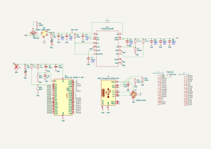
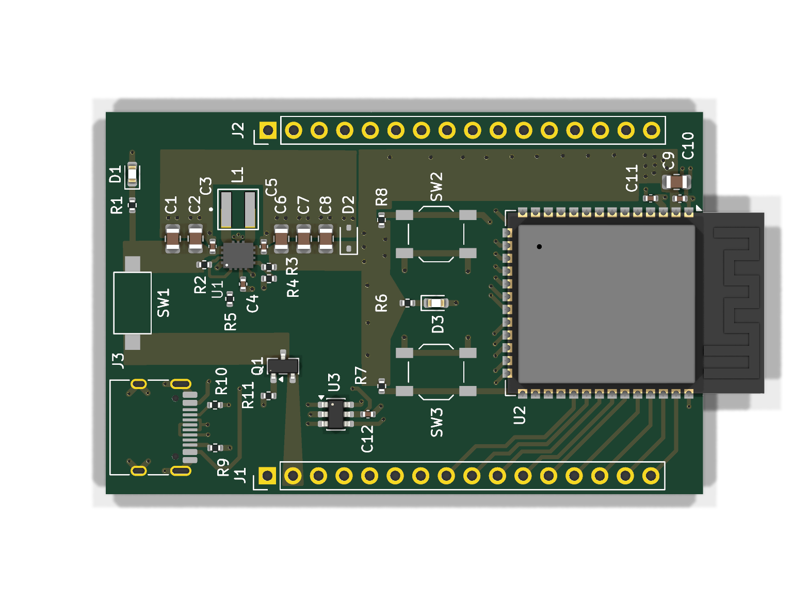
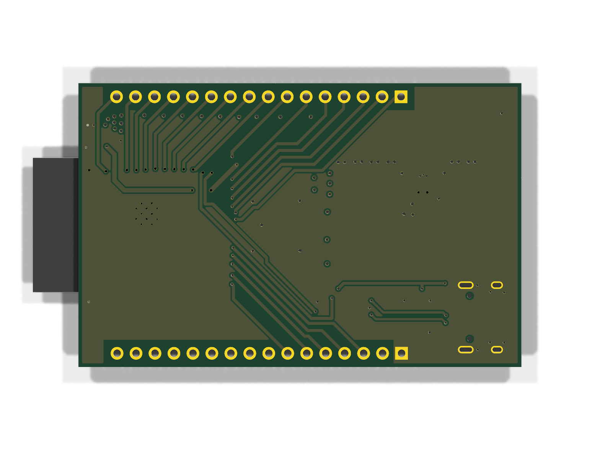

# ESP32-S3 DevKit

Development board built around the [ESP32-S3-WROOM-1](https://www.espressif.com/sites/default/files/documentation/esp32-s3-wroom-1_wroom-1u_datasheet_en.pdf) module with an integrated [TPS63070](https://www.ti.com/lit/ds/symlink/tps63070.pdf) buck-boost converter and USB-C connectivity.

## Specifications

- **MCU**: ESP32-S3-WROOM-1 (Wi-Fi + BLE, dual-core, 32-bit)
- **Power**: TPS63070 buck-boost (2V–16V input, 3.3V regulated output)
- **Interface**: USB-C (USB 2.0, 14-pin receptacle)
- **ESD protection**: USBLC6-2SC6 on USB data lines
- **Layers**: 4
- **Thickness**: 1.6mm
- **Fab targets**: JLCPCB 4-layer, PCBWay 4-layer

## Key Components

| Ref | Value | Description |
|-----|-------|-------------|
| U1 | ESP32-S3-WROOM-1 | Wi-Fi + BLE SoC module |
| U2 | TPS630701RNMR | Buck-boost converter (3.3V output) |
| U3 | USBLC6-2SC6 | USB ESD protection |
| J1 | USB-C 14P | USB-C receptacle (USB 2.0) |
| J2, J3 | Conn_01x16 | GPIO breakout headers |
| L1 | 1.5µH | Buck-boost inductor |
| Q1 | P-MOSFET | Power path control |
| SW1 | ON/OFF | SPST — main power switch |
| SW2 | RESET | Push — ESP32 reset |
| SW3 | BOOT | Push — boot / download mode |
| LED1, LED2 | LED | Status indicators |

<!-- board-images-start -->
## Board Images

_Auto-generated on merge to main._

### Schematic

### PCB Layout

| Top | Bottom |
| :---: | :---: |
|  |  |

<!-- board-images-end -->

<!-- drc-summary-start -->
## KiCad design checks

_Same layout as the KiCad check summary on pull requests (ERC, DRC, fab rules). Auto-generated on merge to main._

| Check | Result |
|:------|:-------|
| ERC | 🔴 3 errors, 🟡 4 warnings |
| DRC | 🔴 10 errors, 🟡 4 warnings |
| Fab: jlcpcb-4layer | 🔴 140 errors, 🟡 7 warnings |
| Fab: pcbway-4layer | 🔴 30 errors, 🟡 77 warnings |

<strong>ERC</strong> — 🔴 3 errors, 🟡 4 warnings

> 

> 
🔴 <b><code>power_pin_not_driven</code></b> — 3 errors

>
> Input Power pin not driven by any Output Power pins
> - `Symbol U1 Pin 12 [VIN, Power input, Line]`
> - `Symbol U1 Pin 7 [VOUT, Power input, Line]`
> - `Symbol U1 Pin 4 [GND, Power input, Line]`
>
> 

>
> 

> 
🟡 <b><code>lib_symbol_mismatch</code></b> — 1 warning

>
> Symbol 'TPS630701RNMR' doesn't match copy in library 'TPS630701 Buck-Boost'
> - `Symbol U1 [TPS630701RNMR]`
>
> 

>
> 

> 
🟡 <b><code>pin_to_pin</code></b> — 3 warnings

>
> Pins of type Unspecified and Passive are connected
> - `Symbol U1 Pin 11 [L1, Unspecified, Line]` / `Symbol L1 Pin 1 [1, Passive, Line]`
> - `Symbol U1 Pin 3 [VAUX, Unspecified, Line]` / `Symbol C4 Pin 1 [Passive, Line]`
> - `Symbol U1 Pin 9 [L2, Unspecified, Line]` / `Symbol L1 Pin 2 [2, Passive, Line]`
>
> 

>

<strong>DRC</strong> — 🔴 10 errors, 🟡 4 warnings

> **Violations** (12)
>
> 

> 
🔴 <b><code>clearance</code></b> — 7 errors

>
> Clearance violation ( clearance 0.1500 mm; actual 0.1322 mm)
> - `Via [GND] on F.Cu - B.Cu` / `Pad 9 [Net-(U1-L2)] of U1 on F.Cu`
> - `Track [Net-(U1-L1)] on F.Cu, length 0.7276 mm` / `Via [GND] on F.Cu - B.Cu`
> - `Track [Net-(U1-L2)] on F.Cu, length 0.6852 mm` / `Via [GND] on F.Cu - B.Cu`
> - `Track [Net-(U1-L2)] on F.Cu, length 0.0106 mm` / `Via [GND] on F.Cu - B.Cu`
> - `Track [Net-(U1-L2)] on F.Cu, length 2.9080 mm` / `Via [GND] on F.Cu - B.Cu`
> - `Via [GND] on F.Cu - B.Cu` / `Track [Net-(U1-L2)] on F.Cu, length 0.0780 mm`
> - `Via [GND] on F.Cu - B.Cu` / `Track [Net-(U1-L1)] on F.Cu, length 2.8830 mm`
>
> 

>
> 

> 
🔴 <b><code>hole_clearance</code></b> — 1 error

>
> Hole clearance violation (board setup constraints hole clearance 0.2500 mm; actual 0.2322 mm)
> - `Pad 9 [Net-(U1-L2)] of U1 on F.Cu` / `Via [GND] on F.Cu - B.Cu`
>
> 

>
> 

> 
🟡 <b><code>lib_footprint_mismatch</code></b> — 2 warnings

>
> Footprint 'PinHeader_1x16_P2.54mm_Vertical' does not match copy in library 'Connector_PinHeader_2.54mm'
> - `Footprint J2`
> - `Footprint J1`
>
> 

>
> 

> 
🟡 <b><code>silk_edge_clearance</code></b> — 2 warnings

>
> Silkscreen clipped by board edge
> - `Rectangle on Edge.Cuts` / `Segment of U2 on F.Silkscreen`
> - `Rectangle on Edge.Cuts` / `Segment of U2 on F.Silkscreen`
>
> 

>
> **Unconnected items** (2)
>
> 

> 
🔴 <b><code>unconnected_items</code></b> — 2 errors

>
> Missing connection between items
> - `Zone [/3v3] on F.Cu, priority 4` / `Pad 1 [/3v3] of R5 on F.Cu`
> - `Pad 2 [Net-(U1-PG)] of R5 on F.Cu` / `Pad 2 [Net-(U1-PG)] of U1 on F.Cu`
>
> 

>

<strong>Fab DRC: jlcpcb-4layer</strong> — 🔴 140 errors, 🟡 7 warnings

> 

> 
🔴 <b><code>annular_width</code></b> — 107 errors

>
> Annular width (rule 'JLCPCB: Annular ring width (via and PTH)' min annular width 0.1500 mm; actual 0.1000 mm)
> - `Via [GND] on F.Cu - B.Cu`
> - `Via [GND] on F.Cu - B.Cu`
> - `Via [GND] on F.Cu - B.Cu`
> - `Via [GND] on F.Cu - B.Cu`
> - `Via [GND] on F.Cu - B.Cu`
> - `Via [GND] on F.Cu - B.Cu`
> - `Via [GND] on F.Cu - B.Cu`
> - `Via [GND] on F.Cu - B.Cu`
> - `Via [GND] on F.Cu - B.Cu`
> - `Via [GND] on F.Cu - B.Cu`
> - `Via [GND] on F.Cu - B.Cu`
> - `Via [GND] on F.Cu - B.Cu`
> - `Via [GND] on F.Cu - B.Cu`
> - `Via [GND] on F.Cu - B.Cu`
> - `Via [GND] on F.Cu - B.Cu`
> - `Via [GND] on F.Cu - B.Cu`
> - `Via [GND] on F.Cu - B.Cu`
> - `Via [GND] on F.Cu - B.Cu`
> - `Via [GND] on F.Cu - B.Cu`
> - `Via [GND] on F.Cu - B.Cu`
> - `Via [GND] on F.Cu - B.Cu`
> - `Via [GND] on F.Cu - B.Cu`
> - `Via [GND] on F.Cu - B.Cu`
> - `Via [GND] on F.Cu - B.Cu`
> - `Via [GND] on F.Cu - B.Cu`
> - `Via [GND] on F.Cu - B.Cu`
> - `Via [GND] on F.Cu - B.Cu`
> - `Via [GND] on F.Cu - B.Cu`
> - `Via [GND] on F.Cu - B.Cu`
> - `Via [GND] on F.Cu - B.Cu`
> - `Via [GND] on F.Cu - B.Cu`
> - `Via [GND] on F.Cu - B.Cu`
> - `Via [GND] on F.Cu - B.Cu`
> - `Via [GND] on F.Cu - B.Cu`
> - `Via [GND] on F.Cu - B.Cu`
> - `Via [GND] on F.Cu - B.Cu`
> - `Via [GND] on F.Cu - B.Cu`
> - `Via [GND] on F.Cu - B.Cu`
> - `Via [GND] on F.Cu - B.Cu`
> - `Via [GND] on F.Cu - B.Cu`
> - `Via [GND] on F.Cu - B.Cu`
> - `Via [GND] on F.Cu - B.Cu`
> - `Via [GND] on F.Cu - B.Cu`
> - `Via [GND] on F.Cu - B.Cu`
> - `Via [GND] on F.Cu - B.Cu`
> - `Via [GND] on F.Cu - B.Cu`
> - `Via [/GPIO13] on F.Cu - B.Cu`
> - `Via [/GPIO12] on F.Cu - B.Cu`
> - `Via [/GPIO11] on F.Cu - B.Cu`
> - `Via [/GPIO10] on F.Cu - B.Cu`
> - `Via [/GPIO9] on F.Cu - B.Cu`
> - `Via [/GPIO46] on F.Cu - B.Cu`
> - `Via [/GPIO3] on F.Cu - B.Cu`
> - `Via [/GPIO8] on F.Cu - B.Cu`
> - `Via [/GPIO18] on F.Cu - B.Cu`
> - `Via [/GPIO17] on F.Cu - B.Cu`
> - `Via [/GPIO16] on F.Cu - B.Cu`
> - `Via [/GPIO15] on F.Cu - B.Cu`
> - `Via [/GPIO7] on F.Cu - B.Cu`
> - `Via [/GPIO6] on F.Cu - B.Cu`
> - `Via [/GPIO5] on F.Cu - B.Cu`
> - `Via [/GPIO4] on F.Cu - B.Cu`
> - `Via [/3v3] on F.Cu - B.Cu`
> - `Via [/3v3] on F.Cu - B.Cu`
> - `Via [/3v3] on F.Cu - B.Cu`
> - `Via [/3v3] on F.Cu - B.Cu`
> - `Via [/3v3] on F.Cu - B.Cu`
> - `Via [/3v3] on F.Cu - B.Cu`
> - `Via [/3v3] on F.Cu - B.Cu`
> - `Via [/3v3] on F.Cu - B.Cu`
> - `Via [/3v3] on F.Cu - B.Cu`
> - `Via [/3v3] on F.Cu - B.Cu`
> - `Via [/3v3] on F.Cu - B.Cu`
> - `Via [/3v3] on F.Cu - B.Cu`
> - `Via [/3v3] on F.Cu - B.Cu`
> - `Via [/3v3] on F.Cu - B.Cu`
> - `Via [/3v3] on F.Cu - B.Cu`
> - `Via [/3v3] on F.Cu - B.Cu`
> - `Via [/3v3] on F.Cu - B.Cu`
> - `Via [/3v3] on F.Cu - B.Cu`
> - `Via [/3v3] on F.Cu - B.Cu`
> - `Via [/3v3] on F.Cu - B.Cu`
> - `Via [/3v3] on F.Cu - B.Cu`
> - `Via [/3v3] on F.Cu - B.Cu`
> - `Via [/3v3] on F.Cu - B.Cu`
> - `Via [/3v3] on F.Cu - B.Cu`
> - `Via [/3v3] on F.Cu - B.Cu`
> - `Via [Net-(U2-EN)] on F.Cu - B.Cu`
> - `Via [Net-(U2-EN)] on F.Cu - B.Cu`
> - `Via [Net-(U2-EN)] on F.Cu - B.Cu`
> - `Via [Net-(U2-EN)] on F.Cu - B.Cu`
> - `Via [Net-(U3-VBUS)] on F.Cu - B.Cu`
> - `Via [Net-(U3-VBUS)] on F.Cu - B.Cu`
> - `Via [Net-(U3-VBUS)] on F.Cu - B.Cu`
> - `Via [/D-] on F.Cu - B.Cu`
> - `Via [/D-] on F.Cu - B.Cu`
> - `Via [/D+] on F.Cu - B.Cu`
> - `Via [/D+] on F.Cu - B.Cu`
> - `Via [/GPIO14] on F.Cu - B.Cu`
> - `Via [/GPIO21] on F.Cu - B.Cu`
> - `Via [/GPIO47] on F.Cu - B.Cu`
> - `Via [/GPIO48] on F.Cu - B.Cu`
> - `Via [/GPIO45] on F.Cu - B.Cu`
> - `Via [Net-(J3-D--PadA7)] on F.Cu - B.Cu`
> - `Via [Net-(J3-D--PadA7)] on F.Cu - B.Cu`
> - `Via [Net-(J3-D+-PadA6)] on F.Cu - B.Cu`
> - `Via [Net-(J3-D+-PadA6)] on F.Cu - B.Cu`
>
> 

>
> 

> 
🔴 <b><code>clearance</code></b> — 25 errors

>
> Clearance violation (rule 'JLCPCB: Track to pad' clearance 0.2000 mm; actual 0.1510 mm)
> - `Track [GND] on F.Cu, length 0.4747 mm` / `Pad 9 [Net-(U1-L2)] of U1 on F.Cu`
> - `Pad 6 [GND] of U1 on F.Cu` / `Track [Net-(U1-FB)] on F.Cu, length 0.7100 mm`
> - `Track [/GPIO14] on F.Cu, length 1.5875 mm` / `Pad 23 [/GPIO21] of U2 on F.Cu`
> - `Track [Net-(U1-FB)] on F.Cu, length 1.4425 mm` / `Pad 2 [GND] of R4 on F.Cu`
> - `Pad 14 [Net-(U1-EN)] of U1 on F.Cu` / `Track [/2-16v] on F.Cu, length 0.0707 mm`
> - `Pad 14 [Net-(U1-EN)] of U1 on F.Cu` / `Track [GND] on F.Cu, length 0.3050 mm`
> - `Track [/GPIO48] on F.Cu, length 1.4319 mm` / `Pad 26 [/GPIO45] of U2 on F.Cu`
> - `Pad 14 [Net-(U1-EN)] of U1 on F.Cu` / `Track [GND] on F.Cu, length 0.5409 mm`
> - `Pad 11 [Net-(U1-L1)] of U1 on F.Cu` / `Track [GND] on F.Cu, length 0.5030 mm`
> - `Pad 2 [Net-(U1-PG)] of U1 on F.Cu` / `Track [Net-(U1-VAUX)] on F.Cu, length 1.0100 mm`
> - `Track [Net-(U1-L2)] on F.Cu, length 0.6852 mm` / `Via [GND] on F.Cu - B.Cu`
> - `Track [Net-(U1-L2)] on F.Cu, length 0.0106 mm` / `Via [GND] on F.Cu - B.Cu`
> - `Track [Net-(U1-L2)] on F.Cu, length 2.9080 mm` / `Via [GND] on F.Cu - B.Cu`
> - `Track [Net-(U1-L2)] on F.Cu, length 0.0780 mm` / `Pad 10 [GND] of U1 on F.Cu`
> - `Pad A6 [Net-(J3-D+-PadA6)] of J3 on F.Cu` / `Track [Net-(J3-D--PadA7)] on F.Cu, length 0.4300 mm`
> - `Track [Net-(U1-L1)] on F.Cu, length 0.7276 mm` / `Via [GND] on F.Cu - B.Cu`
> - `Pad A6 [Net-(J3-D+-PadA6)] of J3 on F.Cu` / `Track [Net-(J3-D--PadA7)] on F.Cu, length 0.4700 mm`
> - `Pad A6 [Net-(J3-D+-PadA6)] of J3 on F.Cu` / `Track [Net-(J3-D--PadA7)] on F.Cu, length 0.7100 mm`
> - `Track [Net-(U1-L1)] on F.Cu, length 0.0830 mm` / `Pad 10 [GND] of U1 on F.Cu`
> - `Via [GND] on F.Cu - B.Cu` / `Track [Net-(U1-L1)] on F.Cu, length 2.8830 mm`
> - `Track [Net-(J3-D+-PadA6)] on F.Cu, length 0.0707 mm` / `Pad B7 [Net-(J3-D--PadA7)] of J3 on F.Cu`
> - `Track [Net-(J3-D+-PadA6)] on F.Cu, length 0.9600 mm` / `Pad A7 [Net-(J3-D--PadA7)] of J3 on F.Cu`
> - `Pad B7 [Net-(J3-D--PadA7)] of J3 on F.Cu` / `Track [Net-(J3-D+-PadA6)] on F.Cu, length 0.9350 mm`
> - `Track [Net-(J3-CC2)] on F.Cu, length 1.7100 mm` / `Pad A8 [<no net>] of J3 on F.Cu`
> - `Pad 2 [GND] of C12 on F.Cu` / `Track [Net-(U3-VBUS)] on F.Cu, length 0.9440 mm`
>
> 

>
> 

> 
🔴 <b><code>hole_clearance</code></b> — 8 errors

>
> Hole clearance violation (rule 'JLCPCB: Track to PTH hole' clearance 0.3300 mm; actual 0.3076 mm)
> - `Track [Net-(U3-VBUS)] on F.Cu, length 1.6829 mm` / `Via [/D-] on F.Cu - B.Cu`
> - `Track [/GPIO4] on B.Cu, length 6.1908 mm` / `Via [GND] on F.Cu - B.Cu`
> - `Track [/GPIO5] on B.Cu, length 8.6575 mm` / `Via [/3v3] on F.Cu - B.Cu`
> - `Pad 9 [Net-(U1-L2)] of U1 on F.Cu` / `Via [GND] on F.Cu - B.Cu`
> - `Track [/GPIO13] on B.Cu, length 13.9548 mm` / `Via [GND] on F.Cu - B.Cu`
> - `Track [/D+] on B.Cu, length 10.1889 mm` / `Via [GND] on F.Cu - B.Cu`
> - `Track [/GPIO12] on F.Cu, length 1.4390 mm` / `Via [/GPIO13] on F.Cu - B.Cu`
> - `Pad 9 [Net-(U1-L2)] of U1 on F.Cu` / `Via [GND] on F.Cu - B.Cu`
>
> 

>
> 

> 
🟡 <b><code>hole_to_hole</code></b> — 2 warnings

>
> Drilled hole too close to other hole (rule 'JLCPCB: Hole to hole, same net' min 0.2535 mm; actual 0.2466 mm)
> - `Via [GND] on F.Cu - B.Cu` / `Via [GND] on F.Cu - B.Cu`
> - `Via [GND] on F.Cu - B.Cu` / `Via [GND] on F.Cu - B.Cu`
>
> 

>
> 

> 
🟡 <b><code>lib_footprint_mismatch</code></b> — 2 warnings

>
> Footprint 'PinHeader_1x16_P2.54mm_Vertical' does not match copy in library 'Connector_PinHeader_2.54mm'
> - `Footprint J2`
> - `Footprint J1`
>
> 

>
> 

> 
🟡 <b><code>silk_edge_clearance</code></b> — 2 warnings

>
> Silkscreen clipped by board edge
> - `Rectangle on Edge.Cuts` / `Segment of U2 on F.Silkscreen`
> - `Rectangle on Edge.Cuts` / `Segment of U2 on F.Silkscreen`
>
> 

>
> 

> 
🟡 <b><code>text_thickness</code></b> — 1 warning

>
> Text thickness out of range (rule 'JLCPCB: Silkscreen text' min thickness 0.1500 mm; actual 0.1000 mm)
> - `Reference field of U1`
>
> 

>

<strong>Fab DRC: pcbway-4layer</strong> — 🔴 30 errors, 🟡 77 warnings

> 

> 
🔴 <b><code>annular_width</code></b> — 4 errors

>
> Annular width (rule 'PCBWay: Pad size' min annular width 0.2500 mm; actual 0.1957 mm)
> - `PTH pad SH [GND] of J3`
> - `PTH pad SH [GND] of J3`
> - `PTH pad SH [GND] of J3`
> - `PTH pad SH [GND] of J3`
>
> 

>
> 

> 
🔴 <b><code>clearance</code></b> — 7 errors

>
> Clearance violation (netclass 'Default' clearance 0.1500 mm; actual 0.1322 mm)
> - `Via [GND] on F.Cu - B.Cu` / `Pad 9 [Net-(U1-L2)] of U1 on F.Cu`
> - `Track [Net-(U1-L1)] on F.Cu, length 0.7276 mm` / `Via [GND] on F.Cu - B.Cu`
> - `Track [Net-(U1-L2)] on F.Cu, length 0.6852 mm` / `Via [GND] on F.Cu - B.Cu`
> - `Track [Net-(U1-L2)] on F.Cu, length 0.0106 mm` / `Via [GND] on F.Cu - B.Cu`
> - `Track [Net-(U1-L2)] on F.Cu, length 2.9080 mm` / `Via [GND] on F.Cu - B.Cu`
> - `Via [GND] on F.Cu - B.Cu` / `Track [Net-(U1-L2)] on F.Cu, length 0.0780 mm`
> - `Via [GND] on F.Cu - B.Cu` / `Track [Net-(U1-L1)] on F.Cu, length 2.8830 mm`
>
> 

>
> 

> 
🔴 <b><code>drill_out_of_range</code></b> — 16 errors

>
> Hole size out of range (rule 'PCBWay: Pad size' min hole 0.5000 mm; actual 0.2000 mm)
> - `PTH pad 41 [GND] of U2`
> - `PTH pad 41 [GND] of U2`
> - `PTH pad 41 [GND] of U2`
> - `PTH pad 41 [GND] of U2`
> - `PTH pad 41 [GND] of U2`
> - `PTH pad 41 [GND] of U2`
> - `PTH pad 41 [GND] of U2`
> - `PTH pad 41 [GND] of U2`
> - `PTH pad 41 [GND] of U2`
> - `PTH pad 41 [GND] of U2`
> - `PTH pad 41 [GND] of U2`
> - `PTH pad 41 [GND] of U2`
> - `Via [GND] on F.Cu - B.Cu`
> - `Via [GND] on F.Cu - B.Cu`
> - `Via [GND] on F.Cu - B.Cu`
> - `Via [Net-(U2-EN)] on F.Cu - B.Cu`
>
> 

>
> 

> 
🔴 <b><code>hole_clearance</code></b> — 3 errors

>
> Hole clearance violation (rule 'PCBWay: Via to track' clearance 0.2540 mm; actual 0.2500 mm)
> - `Track [/GPIO4] on B.Cu, length 6.1908 mm` / `Via [GND] on F.Cu - B.Cu`
> - `Track [/D+] on B.Cu, length 10.1889 mm` / `Via [GND] on F.Cu - B.Cu`
> - `Pad 9 [Net-(U1-L2)] of U1 on F.Cu` / `Via [GND] on F.Cu - B.Cu`
>
> 

>
> 

> 
🟡 <b><code>hole_to_hole</code></b> — 2 warnings

>
> Drilled hole too close to other hole (rule 'PCBWay: Via to via, same net' min 0.2535 mm; actual 0.2466 mm)
> - `Via [GND] on F.Cu - B.Cu` / `Via [GND] on F.Cu - B.Cu`
> - `Via [GND] on F.Cu - B.Cu` / `Via [GND] on F.Cu - B.Cu`
>
> 

>
> 

> 
🟡 <b><code>lib_footprint_mismatch</code></b> — 2 warnings

>
> Footprint 'PinHeader_1x16_P2.54mm_Vertical' does not match copy in library 'Connector_PinHeader_2.54mm'
> - `Footprint J2`
> - `Footprint J1`
>
> 

>
> 

> 
🟡 <b><code>silk_edge_clearance</code></b> — 2 warnings

>
> Silkscreen clipped by board edge
> - `Rectangle on Edge.Cuts` / `Segment of U2 on F.Silkscreen`
> - `Rectangle on Edge.Cuts` / `Segment of U2 on F.Silkscreen`
>
> 

>
> 

> 
🟡 <b><code>silk_overlap</code></b> — 70 warnings

>
> Silkscreen clearance (PCBWay: Pad to silkscreen clearance 0.1500 mm; actual 0.0300 mm)
> - `Segment of SW1 on F.Silkscreen` / `Pad 2 [/2-16v] of SW1 on F.Cu`
> - `Segment of R2 on F.Silkscreen` / `Pad 2 [Net-(U1-EN)] of R2 on F.Cu`
> - `Segment of R2 on F.Silkscreen` / `Pad 1 [/2-16v] of R2 on F.Cu`
> - `Segment of C3 on F.Silkscreen` / `Pad 1 [/2-16v] of C3 on F.Cu`
> - `Segment of C3 on F.Silkscreen` / `Pad 2 [GND] of C3 on F.Cu`
> - `Segment of R2 on F.Silkscreen` / `Pad 2 [Net-(U1-EN)] of R2 on F.Cu`
> - `Segment of R2 on F.Silkscreen` / `Pad 1 [/2-16v] of R2 on F.Cu`
> - `Segment of C5 on F.Silkscreen` / `Pad 1 [/3v3] of C5 on F.Cu`
> - `Segment of C5 on F.Silkscreen` / `Pad 2 [GND] of C5 on F.Cu`
> - `Segment of C5 on F.Silkscreen` / `Pad 1 [/3v3] of C5 on F.Cu`
> - `Segment of C5 on F.Silkscreen` / `Pad 2 [GND] of C5 on F.Cu`
> - `Segment of C3 on F.Silkscreen` / `Pad 1 [/2-16v] of C3 on F.Cu`
> - `Segment of C3 on F.Silkscreen` / `Pad 2 [GND] of C3 on F.Cu`
> - `Segment of R1 on F.Silkscreen` / `Pad 1 [/2-16v] of R1 on F.Cu`
> - `Segment of R1 on F.Silkscreen` / `Pad 2 [Net-(D1-K)] of R1 on F.Cu`
> - `Segment of R1 on F.Silkscreen` / `Pad 1 [/2-16v] of R1 on F.Cu`
> - `Segment of R1 on F.Silkscreen` / `Pad 2 [Net-(D1-K)] of R1 on F.Cu`
> - `Segment of R10 on F.Silkscreen` / `Pad 1 [Net-(J3-CC1)] of R10 on F.Cu`
> - `Segment of R10 on F.Silkscreen` / `Pad 2 [GND] of R10 on F.Cu`
> - `Segment of R10 on F.Silkscreen` / `Pad 1 [Net-(J3-CC1)] of R10 on F.Cu`
> - `Segment of R10 on F.Silkscreen` / `Pad 2 [GND] of R10 on F.Cu`
> - `Segment of C12 on F.Silkscreen` / `Pad 2 [GND] of C12 on F.Cu`
> - `Segment of C12 on F.Silkscreen` / `Pad 1 [Net-(U3-VBUS)] of C12 on F.Cu`
> - `Segment of R11 on F.Silkscreen` / `Pad 1 [Net-(Q1-G)] of R11 on F.Cu`
> - `Segment of R11 on F.Silkscreen` / `Pad 2 [GND] of R11 on F.Cu`
> - `Segment of R11 on F.Silkscreen` / `Pad 1 [Net-(Q1-G)] of R11 on F.Cu`
> - `Segment of R11 on F.Silkscreen` / `Pad 2 [GND] of R11 on F.Cu`
> - `Segment of R7 on F.Silkscreen` / `Pad 1 [/3v3] of R7 on F.Cu`
> - `Segment of R7 on F.Silkscreen` / `Pad 2 [Net-(U2-IO0)] of R7 on F.Cu`
> - `Segment of R7 on F.Silkscreen` / `Pad 1 [/3v3] of R7 on F.Cu`
> - `Segment of R7 on F.Silkscreen` / `Pad 2 [Net-(U2-IO0)] of R7 on F.Cu`
> - `Segment of C12 on F.Silkscreen` / `Pad 2 [GND] of C12 on F.Cu`
> - `Segment of C12 on F.Silkscreen` / `Pad 1 [Net-(U3-VBUS)] of C12 on F.Cu`
> - `Segment of R9 on F.Silkscreen` / `Pad 1 [Net-(J3-CC2)] of R9 on F.Cu`
> - `Segment of R9 on F.Silkscreen` / `Pad 2 [GND] of R9 on F.Cu`
> - `Segment of R9 on F.Silkscreen` / `Pad 1 [Net-(J3-CC2)] of R9 on F.Cu`
> - `Segment of R9 on F.Silkscreen` / `Pad 2 [GND] of R9 on F.Cu`
> - `Segment of C4 on F.Silkscreen` / `Pad 2 [GND] of C4 on F.Cu`
> - `Segment of C4 on F.Silkscreen` / `Pad 1 [Net-(U1-VAUX)] of C4 on F.Cu`
> - `Segment of C4 on F.Silkscreen` / `Pad 2 [GND] of C4 on F.Cu`
> - `Segment of C4 on F.Silkscreen` / `Pad 1 [Net-(U1-VAUX)] of C4 on F.Cu`
> - `Segment of R5 on F.Silkscreen` / `Pad 1 [/3v3] of R5 on F.Cu`
> - `Segment of R5 on F.Silkscreen` / `Pad 2 [Net-(U1-PG)] of R5 on F.Cu`
> - `Segment of R5 on F.Silkscreen` / `Pad 1 [/3v3] of R5 on F.Cu`
> - `Segment of R5 on F.Silkscreen` / `Pad 2 [Net-(U1-PG)] of R5 on F.Cu`
> - `Segment of R4 on F.Silkscreen` / `Pad 1 [Net-(U1-FB)] of R4 on F.Cu`
> - `Segment of R4 on F.Silkscreen` / `Pad 2 [GND] of R4 on F.Cu`
> - `Segment of R4 on F.Silkscreen` / `Pad 1 [Net-(U1-FB)] of R4 on F.Cu`
> - `Segment of R4 on F.Silkscreen` / `Pad 2 [GND] of R4 on F.Cu`
> - `Segment of R3 on F.Silkscreen` / `Pad 1 [/3v3] of R3 on F.Cu`
> - `Segment of R3 on F.Silkscreen` / `Pad 2 [Net-(U1-FB)] of R3 on F.Cu`
> - `Segment of R3 on F.Silkscreen` / `Pad 1 [/3v3] of R3 on F.Cu`
> - `Segment of R3 on F.Silkscreen` / `Pad 2 [Net-(U1-FB)] of R3 on F.Cu`
> - `Segment of SW1 on F.Silkscreen` / `Pad 1 [/PFET] of SW1 on F.Cu`
> - `Segment of C10 on F.Silkscreen` / `Pad 1 [/3v3] of C10 on F.Cu`
> - `Segment of C10 on F.Silkscreen` / `Pad 2 [GND] of C10 on F.Cu`
> - `Segment of C10 on F.Silkscreen` / `Pad 1 [/3v3] of C10 on F.Cu`
> - `Segment of C10 on F.Silkscreen` / `Pad 2 [GND] of C10 on F.Cu`
> - `Segment of R6 on F.Silkscreen` / `Pad 2 [Net-(D3-K)] of R6 on F.Cu`
> - `Segment of R6 on F.Silkscreen` / `Pad 1 [/3v3] of R6 on F.Cu`
> - `Segment of R6 on F.Silkscreen` / `Pad 2 [Net-(D3-K)] of R6 on F.Cu`
> - `Segment of R6 on F.Silkscreen` / `Pad 1 [/3v3] of R6 on F.Cu`
> - `Segment of R8 on F.Silkscreen` / `Pad 1 [/3v3] of R8 on F.Cu`
> - `Segment of R8 on F.Silkscreen` / `Pad 2 [Net-(U2-EN)] of R8 on F.Cu`
> - `Segment of R8 on F.Silkscreen` / `Pad 2 [Net-(U2-EN)] of R8 on F.Cu`
> - `Segment of R8 on F.Silkscreen` / `Pad 1 [/3v3] of R8 on F.Cu`
> - `Segment of C11 on F.Silkscreen` / `Pad 1 [Net-(U2-EN)] of C11 on F.Cu`
> - `Segment of C11 on F.Silkscreen` / `Pad 2 [GND] of C11 on F.Cu`
> - `Segment of C11 on F.Silkscreen` / `Pad 1 [Net-(U2-EN)] of C11 on F.Cu`
> - `Segment of C11 on F.Silkscreen` / `Pad 2 [GND] of C11 on F.Cu`
>
> 

>
> 

> 
🟡 <b><code>text_thickness</code></b> — 1 warning

>
> Text thickness out of range (rule 'PCBWay: Silkscreen text' min thickness 0.1500 mm; actual 0.1000 mm)
> - `Reference field of U1`
>
> 

>

<!-- drc-summary-end -->

## Status

**In Development** — schematic and initial PCB layout complete. Not yet fabricated.
