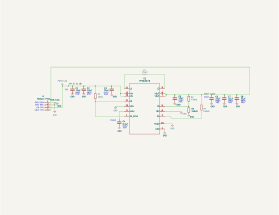
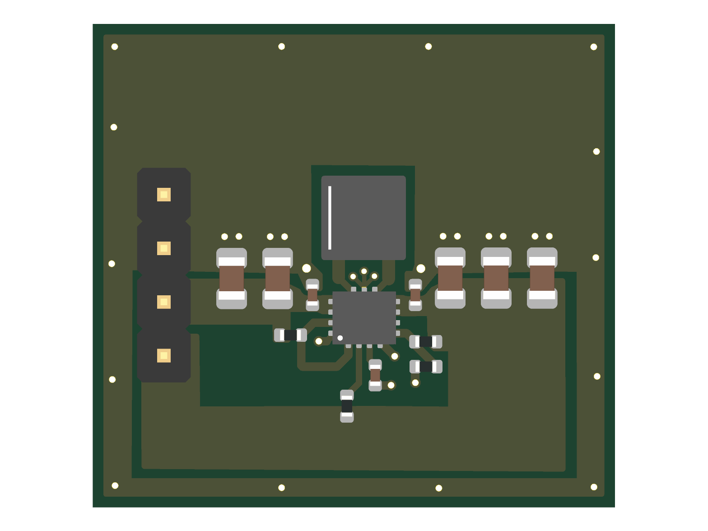
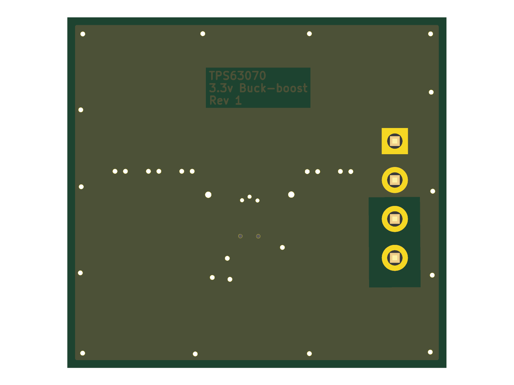
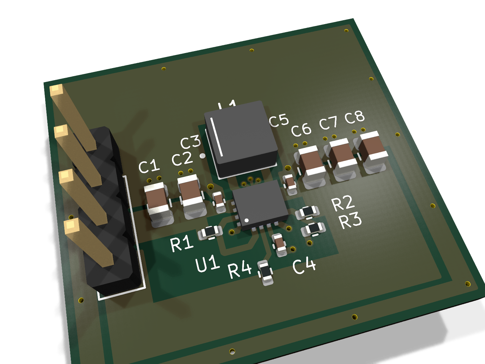

# TPS63070 Buck-Boost Breakout

Standalone breakout board for the [TPS63070](https://www.ti.com/lit/ds/symlink/tps63070.pdf) buck-boost converter. Provides a regulated 3.3V output from a wide input voltage range (2V–16V).

## Specifications

- **Input voltage**: 2V – 16V
- **Output voltage**: 3.3V (default, configurable via feedback divider)
- **Output current**: up to 2A
- **Layers**: 2
- **Thickness**: 1.6mm
- **Fab targets**: JLCPCB 2-layer, PCBWay 2-layer

## Bill of Materials

| Ref | Value | Part Number | Datasheet |
|-----|-------|-------------|-----------|
| U1 | TPS63070 | TPS630701RNMR | [TI TPS63070](https://www.ti.com/lit/ds/symlink/tps63070.pdf) |
| L1 | 1.5µH | XFL4020-152MEC | [Coilcraft XFL4020](https://www.coilcraft.com/en-us/products/power/shielded-inductors/molded-inductors/xfl/xfl4020/) |
| C1, C2, C3 | 10µF | — | Input decoupling |
| C4 | 0.1µF | — | VAUX decoupling |
| C5 | 10µF | — | Output decoupling |
| C6, C7, C8 | 22µF | — | Output bulk capacitance |
| R1 | 10kΩ | — | EN pull-up |
| R2 | 470kΩ | — | Feedback divider (upper) |
| R3 | 150kΩ | — | Feedback divider (lower) |
| R4 | 100kΩ | — | FB → FB2 scaling resistor |
| J1 | 4-pin header | — | VIN, GND, VOUT, PG |

## Output Voltage Variants

The output voltage is set by the feedback resistor divider (R2/R3): `V_OUT = V_REF × (1 + R2 / R3)` where V_REF = 0.8V. See the [TPS63070 datasheet](https://www.ti.com/lit/ds/symlink/tps63070.pdf) §9.2.2.1 for the formula and recommended values.

| Output Voltage | R2 (upper) | R3 (lower) | Status |
|---------------|-----|-----|--------|
| 3.3V | 470kΩ | 150kΩ | Default configuration |
| 5V | — | — | Planned ([#4](https://github.com/eshelton328/the-forge/issues/4)) |

<!-- board-images-start -->
## Board Images

_Auto-generated on merge to main._

### Schematic

### PCB Layout

| Top | Bottom |
| :---: | :---: |
|  |  |

### 3D Render

| Front | Back |
| :---: | :---: |
|  |  |

<!-- board-images-end -->

<!-- validation-summary-start -->
## Validation Summary

_Run `make validate tps63070-breakout` to regenerate locally._

| Check | Status | Details |
|-------|--------|---------|
| required_components | pass | 15/15 components present |
| required_nets | pass | 3/3 nets present |
| capacitor_budget | pass | input: 30µF (min 20µF); output: 76µF (min 60µF); decoupling: C4 |
| voltage_divider | pass | V_OUT = 3.307V (target 3.3V, 0.20% error) — R2=470kΩ, R3=150kΩ, V_REF=0.8V |
| bom_rules | pass | footprints required; no duplicate refs; datasheets on U1 |
<!-- validation-summary-end -->

## Status

**Migrated** — previously developed as a standalone project ("genesis"). First revision has been fabricated and validated at JLCPCB with confirmed 3.3V output.

### Known DRC items

- **ERC**: VIN and GND nets need `PWR_FLAG` symbols (cosmetic warnings, add in KiCad GUI via Place > Power Port)
- **Fab DRC**: Board was designed before fab rules were added; some clearances and via sizes are below published manufacturer minimums. These should be addressed in the next board revision.
